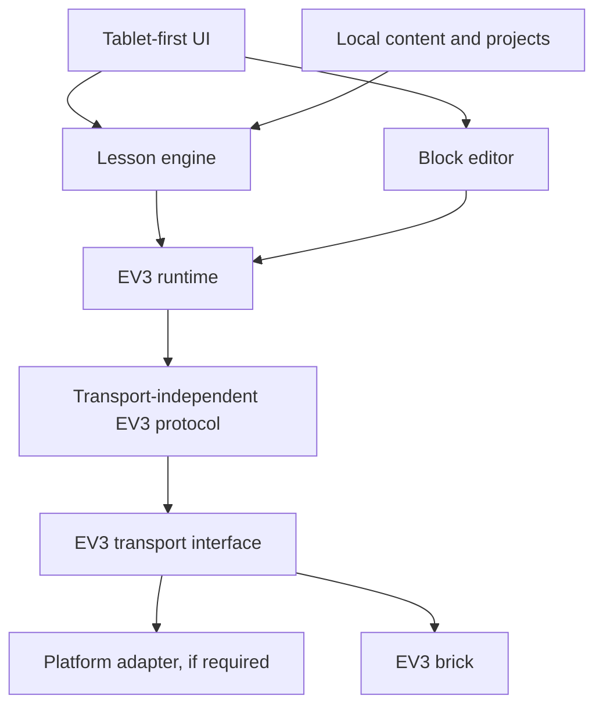

# 11 — Tablet architecture proposal

**Status: PLANNED; platform choice unresolved.** This is a research proposal based on the stated product requirements, not a prototype or compatibility finding. The blocking evidence gap is reliable iPad-to-EV3 communication.

## Candidate comparison

| Option | Web-core reuse | Tablet/offline potential | EV3 transport evidence here | Current assessment |
| --- | --- | --- | --- | --- |
| PWA | High | Potentially high; device APIs and offline behavior need target tests | No verified path; Web Bluetooth is BLE-oriented, while cited EV3 implementation uses Classic RFCOMM | Keep as a web delivery option, not the only iPad plan |
| React + TypeScript + Capacitor | High | Potentially high; native plugins are possible | No verified Classic RFCOMM path on iOS; native plugins do not remove OS API limits. Wi-Fi merits testing | Candidate for web-core reuse if a viable native transport is demonstrated |
| React Native | Partial; web UI reuse is not automatic | Native device integration possible | None | Compare if native transport or touch performance requires it |
| Swift / Kotlin native | Low cross-platform UI reuse | Strong platform-native access potential | None | Fallback if required transport cannot be exposed safely through a hybrid host |

This comparison is qualitative; performance, APIs, and connectivity have not been measured. The independent `ev3-python3` implementation uses Classic Bluetooth RFCOMM and also supports Wi-Fi, which makes iPad Wi-Fi worth investigating. Apple Core Bluetooth/External Accessory and MDN Web Bluetooth are primary documentation leads, but could not be fetched in this pass. A Capacitor plugin is an integration mechanism, not proof that iPadOS exposes the required transport.

## Proposed boundaries

Keep lesson/content models, editor state, runtime intent, protocol encoding, and device transport separately testable. Use a local-first content store; choose IndexedDB, OPFS, Capacitor Filesystem, or SQLite only after storage and offline requirements are tested. An importer should be a separate tool boundary from shipped content.

## Decision gate

Before selecting a mobile host, verify current platform API constraints and produce a minimal proof on a current iPad: connect using a documented, permitted transport, read battery and port state, execute a safe motor command, stop, disconnect/reconnect, and show actionable permission/errors. Test Wi-Fi as well as any legally and technically available Bluetooth option. Repeat on Android before claiming parity. If neither web nor a Capacitor-native adapter supports the required transport, evaluate native alternatives or an explicitly supported gateway with the same proof checklist. Record the outcome in an ADR only after evidence exists.
